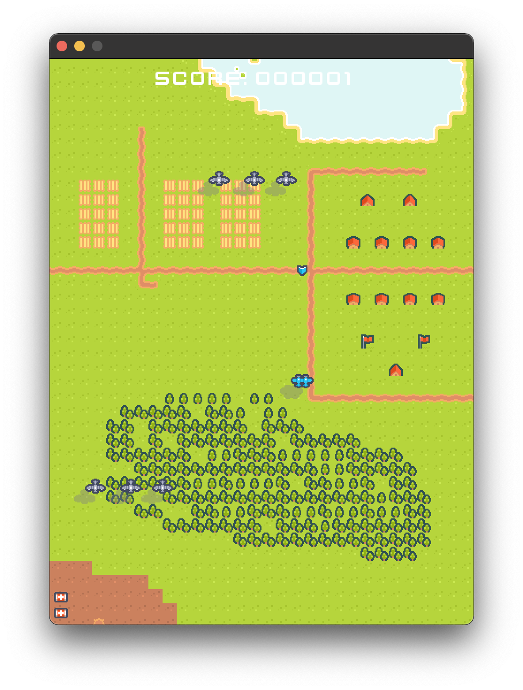
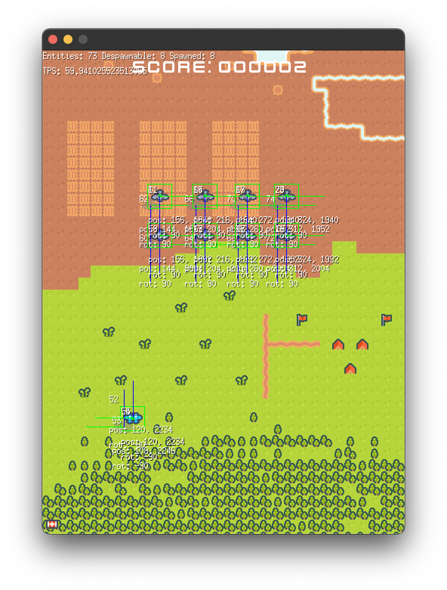
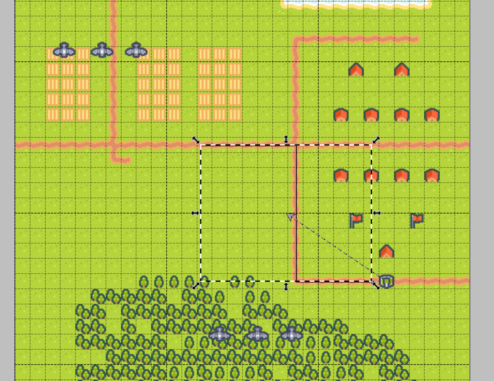

# airplanes

[](https://github.com/m110/airplanes/blob/master/LICENSE)
[](https://goreportcard.com/report/github.com/m110/airplanes)
[](https://github.com/m110/airplanes/actions/workflows/deploy-web.yml)
[](https://m110.github.io/airplanes/)

A 2D shoot 'em up game made with:

* Go
* [Ebitengine](https://github.com/hajimehoshi/ebiten)
* [donburi](https://github.com/yohamta/donburi)
* [Tiled](https://www.mapeditor.org/) and [go-tiled](https://github.com/lafriks/go-tiled)

Assets by [Kenney](https://kenney.nl).



## GitHub GameOff Disclaimer

Most of this game was created during October 2022. I wanted to take part in GitHub GameOff,
but sadly didn't have enough time to create a new game.

I'm submitting this one and I hope this is still in the spirit of the competition since it was created pretty much within one month.
You be the judge. :)

## Status

Playable, with a long list of ideas and TODOs in the code. There are just two levels right now.

## How to play

* Player 1: WASD to move, Space to shoot
* Player 2: Arrow keys to move, Enter to shoot

## Playing

Play online: https://m110.github.io/airplanes/

Or:

```
go run .
```

## Debug Mode

To enable debug mode, press the slash key (`/`).



## Architecture

This game uses the ECS architecture provided by [donburi](https://github.com/yohamta/donburi).
Parts of airplanes were ported to donburi as features.

The ECS structure is as follows:

* `component` - contains all components. **Components** are Go structs with no behavior other than occasional helper methods.
* `system` - contains all systems. **Systems** keep the logic of the game. Each system works on entities with a specific set of components.
* `archetype` - contains helper functions for creating entities with specific sets of components.

Other packages:

* `assets` - contains all assets. Assets are loaded using Go embedding, so they are compiled into the final binary (which makes it easier to distribute the game).
* `engine` - helper functions for generic game logic.
* `scenes` - contains all scenes.

## Level Editor

You can edit the levels in the `assets/levels` directory using [Tiled](https://www.mapeditor.org/).

Levels are loaded using the `level*.tmx` pattern, so you can add new levels by adding new files with bigger numbers.



Supported objects are:

| Object                  | Description                               |
|-------------------------|-------------------------------------------|
| `enemy-airplane`        | An enemy airplane.                        |
| `enemy-tank`            | An enemy tank shooting at the player.     |
| `enemy-turret-missiles` | An enemy turret shooting homing missiles. |
| `group-spawn`           | A group enemy spawn.                      |

The rotation of objects is reflected in-game.

Parameters:

| Parameter | Description                                                                  |
|-----------|------------------------------------------------------------------------------|
| `speed`   | Speed of the enemy, if different than default.                               |
| `path`    | Path of the enemy. If not provided, the enemy moves in the facing direction. |
| `spawn`   | Group spawn, if a group of enemies needs to spawn at once.                   |   

The `path` should point to either a polygon or a polyline object in the same layer.
If a polyline is used, the enemy will follow the path and keep moving in the facing direction after the last point.
Polygon paths work like loops.

### Spawning

Enemies are spawned once the top camera boundary reaches their position.
A group spawn spawns all connected enemies at once.

All objects despawn once they go out of screen.
